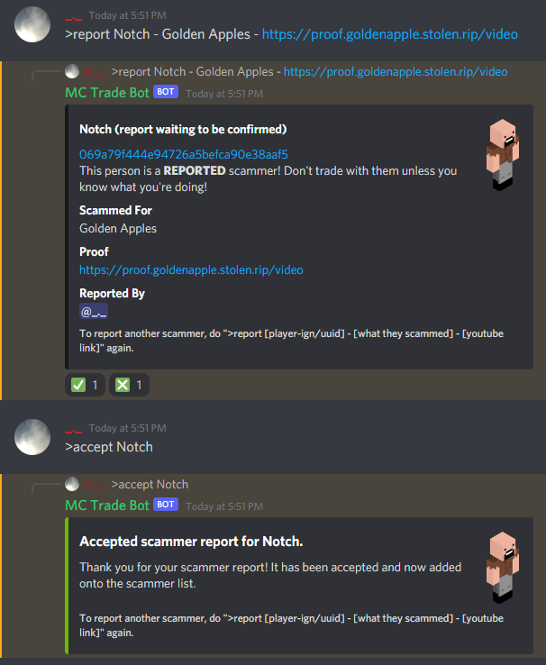
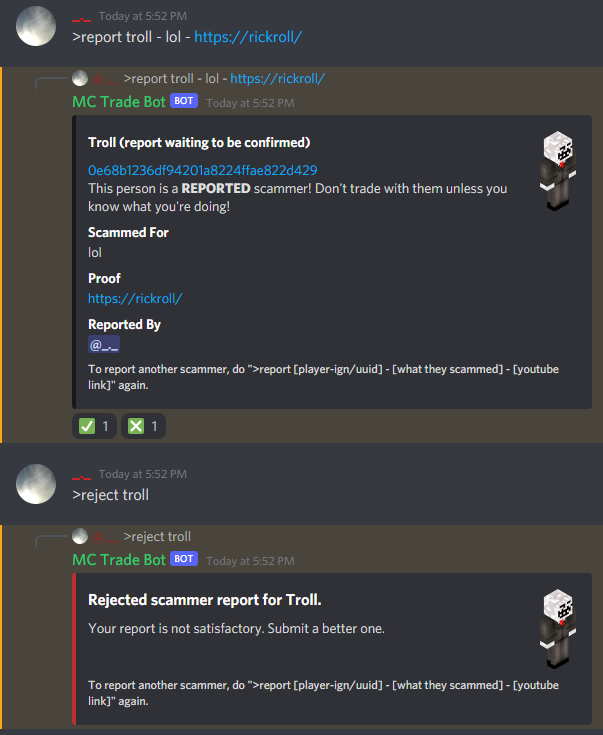
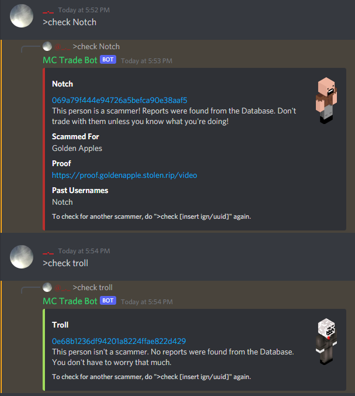

<p align="center">
  
</p>

# MC Trade Bot

[](https://github.com/udu3324/MC-Trade-Bot/releases/latest)


## About the Bot
MC Trade Bot is by udu3324. MC Trade Bot is a QOL tool for traders on MC. You can easily report scammers and check for their status.

## Examples
A report being accepted



A report being rejected



Users being checked



## Bot Documentation
### Variables
Firstly, you need to set staff role id, guild id, report channel id, and check channel id for the bot to work. 
These variables are contained in the Data class.

Data.java
```java
public static String staffRoleID = "100000000000000000";
public static String guildID = "100000000000000000";
public static Long reportChannelID = 100000000000000000L;
public static Long checkChannelID = 100000000000000000L;
```
Commands
```
Member Commands
>help - shows help embed
>check [player-ign/uuid] - checks if they are a scammer
>report [player-ign/uuid] - [what they stole] - [youtube link] - creates a report
>ping - shows time delay between you and the bot
>credits - shows credits of the bot and the server

Staff Commands
>accept [ign/uuid] - accepts the scammer report
>reject [ign/uuid] - rejects the scammer report
```

## How to Contribute
You could contribute to MC Trade Bot by reporting
[issues](https://github.com/udu3324/MC-Trade-Bot/issues/new/choose) and creating
[pull requests](https://github.com/udu3324/MC-Trade-Bot/compare).